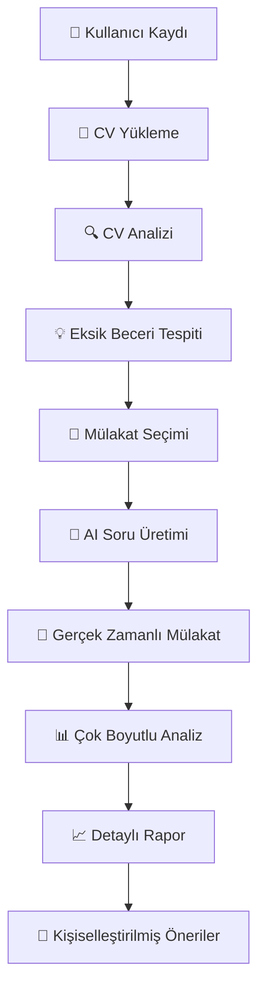

# 🎯 KariyerinOlsun
### AI Destekli Mülakat Hazırlık Sistemi

> **🚀 Yapay zeka destekli mülakat hazırlık platformu ile kariyerinizi bir üst seviyeye taşıyın!**

[Demo](#) • [Dokümantasyon](#) • [Kurulum](#-kurulum) • [Katkıda Bulun](#-katkıda-bulunma)

---

## 📋 Proje Hakkında

**KariyerinOlsun**, öğrencilerin ve profesyonellerin mülakatlara daha iyi hazırlanmasını sağlayan kapsamlı bir yapay zeka destekli platformdur. Sistem, kullanıcıların CV bilgilerini analiz ederek eksik beceri ve bilgileri tespit eder, kişiselleştirilmiş mülakat deneyimi sunar ve detaylı performans analizi sağlar.

### 🎯 Ana Hedef
- ✅ **CV Analizi**: Eksik beceri ve bilgilerin tespiti
- ✅ **AI Mülakat**: Gerçek zamanlı simülasyon
- ✅ **Çok Boyutlu Analiz**: Metin, ses, görüntü ve duygu analizi
- ✅ **Kişiselleştirilmiş Raporlama**: Detaylı performans analizi

## ✨ Özellikler

<table>
<tr>
<td width="50%">

### 🔍 **CV Analiz Sistemi**
- 📄 CV yükleme ve otomatik analiz
- 🔍 İlgili sektördeki eksik bilgi tespiti
- 💡 Kişiselleştirilmiş gelişim önerileri
- 📊 Sektörel bilgi boşluklarının belirlenmesi

### 🎤 **AI Destekli Mülakat**
- ⚡ Gerçek zamanlı mülakat simülasyonu
- 🎯 Sektörel ve pozisyon bazlı soru havuzu
- 🤖 Doğal dil işleme ile akıllı soru üretimi

</td>
<td width="50%">

### 📊 **Çok Boyutlu Analiz**
- 📝 **Metin Analizi**: Cevap kalitesi değerlendirmesi
- 🎵 **Ses Analizi**: Konuşma hızı ve tonlama
- 👁️ **Görüntü Analizi**: Mimik ve beden dili
- 😊 **Duygu Analizi**: Stres ve motivasyon ölçümü

### 📈 **Detaylı Raporlama**
- 📋 Kapsamlı performans raporu
- 💪 Güçlü yönler ve gelişim alanları
- 🎯 Kişiselleştirilmiş öneriler
- 📈 İlerleme takibi ve geçmiş analizler

</td>
</tr>
</table>

## 🛠️ Teknoloji Stack

### Frontend

### Backend

### AI/ML Services

### DevOps

## 🎯 Kullanım Senaryoları

| 🎯 **Adım** | 📋 **İşlem** | 🚀 **Sonuç** |
|-------------|--------------|--------------|
| **1️⃣ CV Analizi** | CV yükleme ve analiz | Eksik beceri tespiti |
| **2️⃣ Mülakat Simülasyonu** | AI destekli sorular | Gerçek zamanlı deneyim |
| **3️⃣ Performans Analizi** | Çok boyutlu değerlendirme | Detaylı raporlama |

### 📊 İş Akışı

### ⭐ Bu projeyi beğendiyseniz yıldız vermeyi unutmayın!

**🚀 Kariyerinizi bir üst seviyeye taşıyın!**

Made with ❤️ by KariyerinOlsun Team

